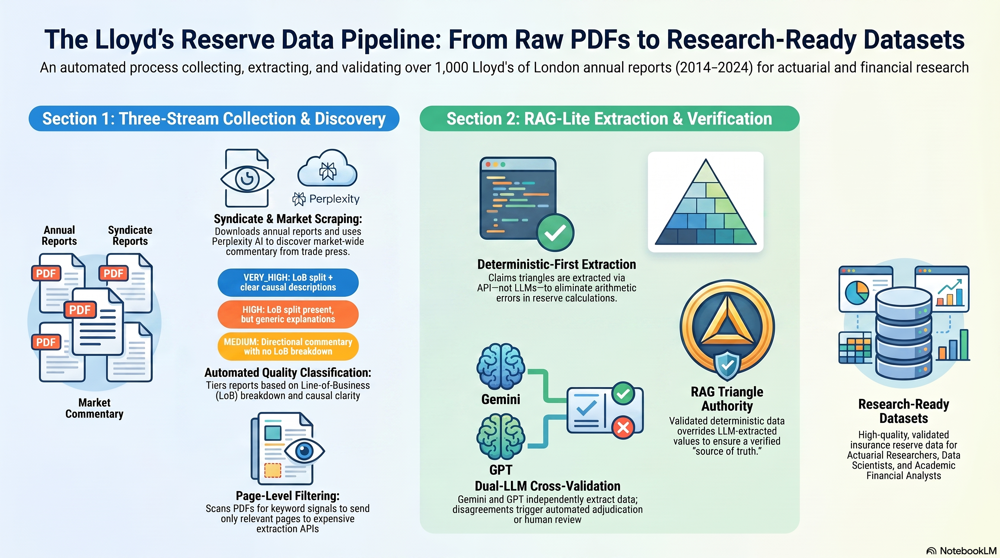

# Lloyd's Reserve Data Collection & Extraction Toolkit

A comprehensive Python toolkit for collecting, extracting, and standardizing Lloyd's of London reserve commentary and numerical reserve data from multiple sources, to support academic research on insurance reserve movements.



## Overview

This toolkit provides three complementary pipelines:

1. **Syndicate Report Scraper** - Downloads and classifies quality of individual syndicate annual reports (2014-2024)
2. **Market Commentary Scraper & Analyzer** - Discovers, scrapes, and standardizes market-wide reserve commentary from multiple sources
3. **PDF Extraction Pipeline** - Extracts structured reserve data (prior year development, LOB breakdowns, claims triangles) from syndicate PDFs using a RAG-lite approach combining deterministic table extraction with dual-LLM verification

Together, these tools produce research-ready datasets by providing:
- **Syndicate-level data**: Detailed line-of-business breakdowns and causal explanations from individual syndicate reports
- **Market-level data**: Standardized reserve movements and causal narratives from official reports, rating agencies, and trade press
- **Structured numerical data**: Claims development triangles with computed prior year development, extracted deterministically and cross-validated against LLM outputs

## Data Locations (for downstream analysis)

The three datasets an analysis project needs, and where to find them:

| Dataset | Location | Format | In git? |
|---------|----------|--------|---------|
| **Syndicate reports** (raw source documents) | `syndicate_reports/pdfs/syndicate_{N}_{YYYY}.pdf` (or `.html` for 2024 iXBRL) | 1,065 PDF/HTML files, 2014–2024 | No (gitignored; re-download with `scripts/download_from_xlsx.py`) |
| **Extracted structured data** (PYD, opening reserves, LoB mix, dual-LLM outputs, RAG triangle) | `pdf_extraction/syndicate_{N}_{YYYY}.json` | 1,065 JSON files (one per syndicate-year) | Yes |
| **RITC occurrence flags** (external RITC detection with evidence/section/page) | `pdf_extraction/ritc_scan.json` | Single JSON keyed `"{syndicate}_{year}"` | Yes |
| **Data audit results** (per-syndicate-year status, source attribution, reconciliations) | `syndicate_reports/coverage/coverage_status.xlsx` (sheets: `syndicate_years`, `by_year`, `by_syndicate`, `reconciliation`), `coverage_status.json` (full detail incl. LoB mixes), `coverage_report.md` | xlsx + JSON + markdown | Yes |
| **Download ledger** (per-row download status, source URLs, failure reasons) | `syndicate_reports/download_status.json` | JSON keyed `"{syndicate}_{year}"` | Yes |
| **Extraction audit trail** (LLM disagreements, rejections, run statistics) | `pdf_extraction/audit/` (`disagreement_log.json`, `rejection_log.json`, `run_manifest.json`) | JSON | Yes |

The syndicate-year denominator is `syndicate_reports/Lloyds_syndicates_2014_2024.xlsx`
(1,125 rows in the broader year-of-account candidate list with report URLs; this is
NOT the active-market denominator, which is the 1,040 SFCR count the spreadsheet's own
note directs use of). A written summary of the audit is in
[docs/data-audit-results.md](docs/data-audit-results.md). To rebuild the coverage outputs
after new downloads or extractions, run `python scripts/build_coverage_status.py`.

## Architecture

### Two-LLM Design for Market Commentary

- **Perplexity** → Source Discovery (web search with citations)
- **ChatGPT** → Summarization & Standardization (consistent text generation)

This separation leverages each LLM's strengths:
- Perplexity excels at finding current sources with real-time web search
- ChatGPT excels at consistent formatting and structured extraction

### RAG-lite PDF Extraction Pipeline

The PDF extraction pipeline (`test_gemini.py` + `table_extraction.py`) uses a layered approach to maximize accuracy:

```
┌─────────────────────────────────────────────────────────────────────┐
│                    PDF EXTRACTION PIPELINE                           │
├─────────────────────────────────────────────────────────────────────┤
│                                                                     │
│  Step 1: Page Classification (PyMuPDF / Tesseract OCR)              │
│  ├── Scan all pages for keyword signals                             │
│  ├── Classify pages: claims_triangle, premium_mix, pl_account,      │
│  │   provisions, reserve_commentary                                 │
│  └── Only send relevant pages to API backends (cost saving)         │
│                                                                     │
│  Step 2: Deterministic Table Extraction                             │
│  ├── Backend selection: Azure / Nutrient / Adobe                    │
│  ├── Extract claims development triangle (gross preferred)          │
│  ├── Extract LOB premium/claims breakdown                           │
│  ├── Extract claims provisions movement note                        │
│  └── Text-based triangle fallback for columnar PDF layouts          │
│                                                                     │
│  Step 3: Triangle Post-Processing (Python)                          │
│  ├── Validate triangle structure (UW years, row counts)             │
│  ├── Handle run-off syndicates (max UW year < report year)          │
│  ├── Detect and strip summary rows                                  │
│  ├── Compute PYD from diagonal differences                          │
│  └── Apply unit conversion (thousands → millions)                   │
│                                                                     │
│  Step 4: LLM Extraction (Gemini + GPT)                              │
│  ├── Independent extraction of all reserve fields                   │
│  ├── Field-by-field comparison with tolerance rules                 │
│  ├── Absolute-amount triangle PYD authoritative (sign rule 10.3)    │
│  ├── Loss-ratio: fills blanks; overrides only on direction clash    │
│  └── Interactive adjudication for unresolved discrepancies          │
│                                                                     │
│  Step 5: Report Classification                                      │
│  ├── first_year_syndicate: <3 UW years, no PYD possible             │
│  ├── no_triangle_data: no triangle or reserve text found            │
│  └── Normal: full extraction with cross-validated PYD               │
│                                                                     │
│  Output: pdf_extraction/syndicate_NNNN_YYYY.json                    │
│                                                                     │
└─────────────────────────────────────────────────────────────────────┘
```

**Key design decisions:**

- **Deterministic-first**: Claims development triangles are extracted by table parsing APIs (not LLMs), then PYD is computed in Python. This eliminates LLM arithmetic errors.
- **LLM as fallback**: When table extraction fails, LLM vision can read triangles from page images, or LLM text extraction reads PYD from reserve narrative text.
- **Dual-LLM verification**: Two independent LLMs (Gemini and GPT) extract the same fields. Disagreements trigger adjudication, either automated (Claude verification) or human review.
- **RAG triangle authority (qualified)**: When a valid *absolute-amount* triangle is extracted deterministically, its computed PYD ordinarily overrides any LLM-extracted value -- unless the gross provisions movement disagrees with it in sign, in which case provisions is authoritative, with the override recorded in the audit trail. A *loss-ratio* triangle is a conditional fallback instead: ordinarily managed- or group-level, it fills a blank narrative value and overrides a syndicate-specific one only where their directions contradict. The full numbered hierarchy is canonical in `docs/ocr-pipeline.md` section 10.3.

## Installation

### Python Dependencies

```bash
# Create virtual environment (recommended)
python -m venv venv
source venv/bin/activate  # On Windows: venv\Scripts\activate

# Install dependencies
pip install -r requirements.txt
```

### OCR Dependencies (for Scanned PDFs)

The syndicate classifier and page scanner include OCR support for scanned PDFs. To enable OCR:

1. **Install Tesseract OCR:**
   - **Windows**: Download from [GitHub releases](https://github.com/UB-Mannheim/tesseract/wiki) or use conda: `conda install -c conda-forge tesseract`
   - **Linux**: `sudo apt-get install tesseract-ocr` (or equivalent)
   - **macOS**: `brew install tesseract`

2. **Install Poppler** (required by pdf2image):
   - **Windows**: Download from [GitHub releases](https://github.com/oschwartz10612/poppler-windows/releases)
   - **Linux**: `sudo apt-get install poppler-utils`
   - **macOS**: `brew install poppler`

The classifier will automatically detect Tesseract in common installation locations (conda environments, Windows default paths, etc.). If OCR libraries are not available, the classifier will fall back to standard text extraction methods (PyMuPDF, pdfplumber) and log a warning.

### Configuration

#### Environment Variables

Create a `.env` file in the project root with your API keys:

```bash
# Required for market commentary source discovery
PERPLEXITY_API_KEY=your-perplexity-api-key

# Required for LLM extraction and summarization
OPENAI_API_KEY=your-openai-api-key
GEMINI_API_KEY=your-gemini-api-key

# Required for table extraction (choose one or more backends)
AZURE_DOCUMENT_INTELLIGENCE_ENDPOINT=your-azure-endpoint
AZURE_DOCUMENT_INTELLIGENCE_KEY=your-azure-key
NUTRIENT_API_KEY=your-nutrient-api-key
ADOBE_PDF_SERVICES_CLIENT_ID=your-adobe-client-id
ADOBE_PDF_SERVICES_CLIENT_SECRET=your-adobe-client-secret

# Optional: For enhanced Google search discovery
GOOGLE_API_KEY=your-google-api-key
GOOGLE_CSE_ID=your-custom-search-engine-id
```

**Note:** The `.env` file is already included in `.gitignore` to keep your API keys secure.

## Quick Start

### Syndicate Reports Pipeline

#### 1. Download syndicate reports

```bash
# Test with a few syndicates
python scripts/lloyds_scraper.py --syndicates 1209,2488,1274 --output ./syndicate_reports

# Download all available reports (takes 2-4 hours)
python scripts/lloyds_scraper.py --all --output ./syndicate_reports --delay 1.5
```

#### 2. Classify quality of downloaded reports

```bash
python scripts/quality_classifier.py --pdf-dir ./syndicate_reports/pdfs --output ./syndicate_reports/quality_report.json
```

#### 3. Extract structured data from reports

```bash
# Run the extraction pipeline (default: Azure Document Intelligence backend)
python test_gemini.py

# Choose a specific table extraction backend
python test_gemini.py --table-backend azure     # Azure Document Intelligence (default)
python test_gemini.py --table-backend nutrient   # Nutrient.io
python test_gemini.py --table-backend adobe      # Adobe PDF Extract

# Process specific syndicates/years
python test_gemini.py --syndicates 1110 --years 2022

# Non-interactive batch mode (no human adjudication)
python test_gemini.py --batch

# Clean and re-run from scratch
python test_gemini.py --clean
```

### Market Commentary Pipeline

#### Step 1: Discover Sources (Perplexity)

```bash
python scripts/perplexity_discovery.py --years 2022 2023 2024
```

#### Step 2: Scrape Discovered Sources

```bash
python scripts/market_commentary_scraper.py --years 2022 2023 2024
```

#### Step 3: Summarize with ChatGPT

```bash
python scripts/chatgpt_summarizer.py --input market_commentary/market_commentary.json --year 2023
```

## PDF Extraction Pipeline — Detailed

### Overview

The extraction pipeline (`test_gemini.py`) processes each syndicate PDF through multiple extraction layers, cross-validates results, and produces structured JSON output with complete audit trails.

### Table Extraction Backends

Deterministic table extraction (`table_extraction.py`) supports three interchangeable backends, but **Azure AI Document Intelligence is the default and the backend that actually processes the corpus**. It is hard-coded as the default (`TABLE_BACKEND = TableBackend.AZURE`, paid S0 tier) and produced essentially all of the extraction outputs. Nutrient and Adobe are optional alternatives selectable with `--table-backend`, used only for spot comparisons.

| Backend | Method | Speed | Accuracy | Cost | Role |
|---------|--------|-------|----------|------|------|
| **Azure** | Azure AI Document Intelligence prebuilt-layout | Fast (2-5s/batch) | High | ~$0.01/page | **Default — processes the corpus** |
| **Nutrient** | Nutrient.io API with targeted pages | Medium (5-10s) | High | ~$0.05/doc | Optional alternative |
| **Adobe** | Adobe PDF Extract API with full document | Slow (30-60s) | High | ~$0.05/doc | Optional alternative |

All backends extract the same three data types:

1. **Claims Development Triangle** — the NxN matrix of cumulative claims by underwriting year and development period
2. **LOB Breakdown** — gross written premiums and claims incurred by line of business (from segmental analysis)
3. **Claims Provisions Movement** — prior year claims development from the provisions note

### Page Classification

Before sending pages to expensive APIs, the pipeline scans all pages using PyMuPDF (or Tesseract OCR for scanned PDFs) and classifies them by keyword signals:

| Tag | Keywords | Purpose |
|-----|----------|---------|
| `claims_triangle` | "claims development", "years later", "cumulative claims", "outstanding claims provision" | Find the claims development triangle |
| `premium_mix` | "segmental analysis", "gross premiums written", "by class of business" | Find LOB premium/claims breakdown |
| `pl_account` | "technical account", "profit and loss", "claims incurred" | Find income statement data |
| `provisions` | "claims outstanding", "prior year", "movement in provision" | Find provisions movement note |

Only pages matching relevant tags are sent to the API backend, reducing cost by 80-90%.

### Claims Development Triangle Extraction

The triangle is the primary source of truth for prior year development. The extraction follows this priority chain:

1. **API table detection** — Azure/Nutrient/Adobe detects table structure from the PDF
2. **Text-based parsing** — Fallback when API doesn't detect the table; parses raw page text from PyMuPDF, handling both inline and columnar layouts
3. **LLM vision** — Last resort; sends a page image to Gemini for structured triangle extraction

#### Triangle Validation

Extracted triangles undergo structural validation before PYD computation:

- **UW year range**: Max underwriting year must be within 2 years of the report year (accommodates run-off syndicates)
- **Row/column ratio**: Number of development rows must be consistent with number of UW year columns, accounting for extra development rows in run-off triangles
- **Column fill pattern**: Oldest column must have the most non-null values (upper-left triangle shape)
- **Gross vs net**: Gross triangles are preferred; net-only triangles are used as fallback
- **Sensitivity table exclusion**: Tables containing "change in assumptions", "impact on", "severity" are excluded

#### Run-Off Syndicate Handling

Run-off syndicates (e.g., syndicate 1110) stopped writing new business but their claims continue developing. Their triangles have:
- Fewer UW year columns than a normal active syndicate
- More development rows than columns (claims continue developing after last UW year)
- Max UW year earlier than the report year (e.g., max UW year 2022 in a 2023 report)

The pipeline handles this by:
- Accepting triangles where `max_uw_year` is within 2 years of `report_year` (not requiring exact match)
- Computing `extra_dev_years = report_year - max_uw_year` to adjust row count validation
- Using `report_year - uw_year >= dev_period` for row sizing in the text-based parser

#### Text-Based Triangle Parser

When the API backend doesn't detect a table (common with certain PDF layouts), the text-based parser (`_parse_triangle_from_text`) extracts the triangle from raw PyMuPDF page text:

1. **Year detection**: Two strategies — years on a single header line, or years on consecutive lines (columnar PyMuPDF output)
2. **Label detection**: Identifies development period rows ("12 months later", "2 years later", etc.) and skips them during number collection
3. **Row grouping**: For each development period d, expects `count(UW years where report_year - year >= d)` values — correctly handles year gaps
4. **Stop detection**: Recognises summary rows ("current year estimate", "less amounts paid", "provision for claims outstanding") to stop collecting triangle data

### Prior Year Development (PYD) Computation

PYD is computed from the triangle in Python, not by LLMs, to avoid arithmetic errors:

```
For each underwriting year column:
  current_estimate  = last non-null value in the column (current diagonal)
  previous_estimate = value one row above (previous diagonal)
  pyd_for_year = current_estimate - previous_estimate

Total PYD = sum of pyd_for_year across all columns except the most recent
```

The most recent UW year column is excluded because it has only one development period — there is no "previous" estimate to compare against.

**Unit handling**: If the triangle is in thousands (£000), the total PYD is divided by 1000 to convert to millions (£m). This is detected from page text keywords ("£000", "£'000", "thousands").

**Summary row stripping**: If the LLM or API includes a "current estimate" summary row at the bottom of the triangle (where every column has a value), it is detected and removed before computation. This prevents double-counting.

### First-Year Syndicate Detection

Syndicates in their first or second year of operation have fewer than 3 underwriting years in their triangle. These are automatically detected and skipped:

- A triangle with < 3 UW years means premiums are still earning through — prior year development cannot be meaningfully separated from current year activity
- The pipeline writes a minimal audit JSON with `"first_year_syndicate": true` and skips LLM extraction entirely (saving API costs)
- LOB breakdown is still extracted if available

### No-Triangle-Data Exclusion

Reports where no claims triangle and no reserve movement text can be found are flagged with `"no_triangle_data": true` and recommended for non-inclusion in downstream analysis:

- The pipeline writes an exclusion JSON with `"excluded": true` and `"exclusion_reason"`
- LLM extraction is skipped (saving API costs)
- LOB breakdown is still extracted if available
- This commonly occurs in run-off syndicate reports from years when no triangle was published

### Dual-LLM Extraction and Cross-Validation

After deterministic table extraction, the pipeline runs two independent LLMs on the full PDF:

1. **Gemini** (gemini-2.5-flash) — extracts all structured fields
2. **GPT** (gpt-5-mini) — independently extracts the same fields

The outputs are compared field-by-field with tolerance rules:

| Field | Tolerance |
|-------|-----------|
| `prior_year_development_gbp_m` | Within ±2.0m or ±5% |
| `opening_reserves_gbp_m` | Within ±5% |
| `gross_premiums_written_gbp_m` | Within ±5% |
| `prior_year_development_pct` | Within ±1.0pp |
| `direction` | Must match exactly |
| `gross_premium_mix` | LOB names fuzzy-matched, amounts within ±10% |

When a deterministic RAG triangle PYD is available from an **absolute-amount** triangle, it ordinarily takes precedence over both LLMs:
- First, where the gross provisions movement is also available, the two are sign-compared; on sign disagreement the provisions movement overrides the triangle (canonical hierarchy: `docs/ocr-pipeline.md` section 10.3)
- If an LLM agrees with the prevailing deterministic value (within ±0.5m), the LLM value is confirmed
- If an LLM disagrees, the absolute-amount triangle value overrides it and the override is recorded in `data_quality_notes`

A **loss-ratio** triangle does not take precedence in the same way. Being ordinarily managed- or group-level, it fills a blank narrative value, and overrides a syndicate-specific narrative value only where the two directions contradict; an agreeing narrative value is retained.

### LLM Output Caching

All LLM API calls are cached in `pdf_extraction/llm_cache/` using SHA-256 hashes of `(model, prompt_version, prompt_text, syndicate, year[, page])`. This means:
- Re-running the pipeline does not re-call LLMs for already-processed reports
- Changing the prompt wording or bumping `PROMPT_VERSION` auto-invalidates affected caches
- Table extraction caches use a separate `_CACHE_VERSION` counter — bump it when extraction logic changes

### Output Format

Each processed report produces a JSON file in `pdf_extraction/`:

```json
{
  "extraction_timestamp": "2025-03-15T10:30:00+00:00",
  "spec": {
    "prompt_version": "2025-03-10-v3",
    "field_definitions_version": "2025-03-08-v2",
    "tolerance_rules_version": "2025-03-08-v1"
  },
  "source_file": "syndicate_reports/pdfs/syndicate_1110_2022.pdf",
  "models": {
    "gemini-2.5-flash": {
      "syndicate_number": 1110,
      "report_year": 2022,
      "opening_reserves_gbp_m": 850.2,
      "prior_year_development_gbp_m": 9.082,
      "prior_year_development_pct": 1.07,
      "direction": "strengthening",
      "gross_premiums_written_gbp_m": 333.4,
      "gross_premium_mix": [
        {"line_of_business": "Reinsurance", "amount_gbp_m": 248.2, "percentage_of_total": 74.4},
        {"line_of_business": "Third party liability", "amount_gbp_m": 72.8, "percentage_of_total": 21.8}
      ],
      "_rag_triangle": {
        "type": "gross",
        "currency": "GBP",
        "units": "thousands",
        "underwriting_years": [2013, 2014, 2015, 2016, 2017, 2018, 2019, 2020, 2022],
        "development_rows": [["...NxN matrix..."]]
      }
    },
    "gpt-5-mini": { "...same fields..." }
  },
  "validation": {
    "passed": true,
    "total_discrepancies": 2,
    "within_tolerance": 2,
    "hard_failures": 0
  }
}
```

For first-year syndicates:
```json
{
  "first_year_syndicate": true,
  "reason": "Syndicate too new -- insufficient underwriting years for prior year development analysis",
  "syndicate": 1322,
  "year": 2023,
  "gross_premium_mix": ["...if available..."]
}
```

For reports with no usable data:
```json
{
  "no_triangle_data": true,
  "excluded": true,
  "exclusion_reason": "No claims development triangle or reserve movement text found in report -- recommend non-inclusion in analysis",
  "syndicate": 1110,
  "year": 2019
}
```

## File Structure

See [file_and_folder_structure.md](file_and_folder_structure.md) for the complete directory tree. Key directories:

```
lloyds_reserve_stress_testing/
│
├── .env                                    # API keys (gitignored)
├── requirements.txt                        # Python dependencies
├── README.md
├── CLAUDE.md                               # AI assistant context (gitignored, local only)
├── table_extraction.py                     # Deterministic table extraction (triangle, LOB, provisions)
├── test_gemini.py                          # Main extraction pipeline (RAG-lite + dual-LLM)
├── adjudicate.py                           # LLM disagreement adjudication
├── manual_override.py                      # Manual override for extraction results
│
├── data/
│   ├── syndicate_numbers.py                # List of syndicate numbers to scrape (~300)
│   └── __init__.py
│
├── docs/                                   # Documentation and validation files
│   ├── data-construction.md                # Data construction methodology
│   ├── exposure-adjustment.md              # Exposure adjustment documentation
│   ├── llm-prompt-development.md           # LLM prompt development notes
│   ├── ocr-pipeline.md                     # OCR pipeline documentation
│   ├── table-4-explanation.md              # Table 4 explanation
│   └── validation/                         # Validation artefacts (xlsx, csv)
│
├── syndicate_reports/                      # Syndicate report outputs (gitignored)
│   ├── pdfs/                               # Downloaded PDF and HTML files (~600+)
│   ├── metadata/                           # reports.json, summary.json, errors.json
│   └── quality_report.json                 # Quality classification results
│
├── pdf_extraction/                         # Extraction pipeline outputs
│   ├── syndicate_NNNN_YYYY.json            # Structured extraction results (~622 files)
│   ├── audit/                              # Disagreement/rejection logs, run manifest
│   ├── adobe_output/                       # Adobe PDF Extract API raw outputs
│   ├── azure_output/                       # Azure Document Intelligence cached results
│   ├── nutrient_output/                    # Nutrient.io cached page extractions
│   ├── html_converted/                     # HTML reports converted for processing
│   ├── llm_cache/                          # LLM response cache (SHA-256 keyed)
│   ├── llm_slim/                           # Slimmed LLM cache
│   ├── ocr_page_cache/                     # Tesseract OCR results per page
│   └── spec/                               # Extraction spec versions
│
├── market_commentary/                      # Market commentary outputs
│   ├── pdfs/                               # Lloyd's official + AM Best reports
│   ├── full_text/                          # Full extracted text (audit trail)
│   ├── market_commentary.json              # Main scraped data
│   ├── audit_manifest.json                 # File manifest with hashes
│   ├── discovered_sources.json             # Perplexity discovery results
│   └── discovered_sources_urls.json        # Extracted URLs from discovery
│
├── results/
│   ├── market/                             # ChatGPT market commentary outputs (2014-2024)
│   │   ├── standardized_movements_YYYY.json
│   │   ├── lob_summaries_YYYY.json
│   │   └── market_report_YYYY.md
│   ├── syndicate/                          # ChatGPT syndicate outputs
│   │   ├── standardized_syndicate_movements.json
│   │   ├── syndicate_summary.json
│   │   ├── year_summary.json
│   │   └── lob_summary.json
│   └── combined/                           # Merged market + syndicate corpus
│       ├── unified_corpus.json             # Combined market + syndicate data
│       ├── corpus_by_lob.json              # Organized by line of business
│       ├── corpus_by_year.json             # Organized by year
│       └── corpus_summary.json             # Summary statistics
│
├── scripts/
│   ├── lloyds_scraper.py                   # Syndicate report downloader
│   ├── download_from_xlsx.py               # xlsx-driven report downloader
│   ├── quality_classifier.py               # Reserve commentary quality classifier
│   ├── ocr_scanned_pdfs.py                 # OCR processing for scanned PDFs
│   ├── build_coverage_status.py            # Build coverage/audit outputs
│   ├── syndicate_summarizer.py             # ChatGPT syndicate summarization
│   ├── market_commentary_scraper.py        # Market commentary scraper
│   ├── chatgpt_summarizer.py               # ChatGPT market summarization
│   ├── perplexity_discovery.py             # Source discovery via Perplexity
│   ├── merge_corpus.py                     # Merge market + syndicate data
│   └── analyse_strengthenings.py           # Analysis utilities
│
└── analysis/                               # Analysis outputs (gitignored)
    └── quality.json
```

## Quality Classification Criteria

The syndicate classifier uses a 4-tier system based on line-of-business (LoB) breakdown and causal clarity:

| Quality             | Criteria                                                                  | Example                                                                                                                          |
| ------------------- | ------------------------------------------------------------------------- | -------------------------------------------------------------------------------------------------------------------------------- |
| **VERY_HIGH**       | Clear split by line of business WITH clear causal descriptions            | "Marine: £36.1m release due to favourable large loss experience; Property: £5.3m strengthening from inflation impacts"         |
| **HIGH**            | Split by line of business, but lacking clarity on root causes             | "Marine: £36.1m release; Property: £5.3m release; Aviation: £12.4m surplus" (with division breakdown but generic explanation) |
| **MEDIUM**          | Some reserve commentary with direction/amounts but no clear LoB breakdown | "Overall reserve release of £54.7m due to favourable experience" (no class-specific breakdown)                                  |
| **LOW**             | Minimal commentary, boilerplate text, or extraction failed                | General reserve discussion without class-specific details or quantified movements                                                |

**Key Classification Factors:**

- **Primary factor**: Line of business breakdown (multiple classes with amounts) → determines HIGH/VERY_HIGH vs MEDIUM/LOW
- **Secondary factor**: Causal clarity (specific root cause terms like "catastrophe", "inflation", "IBNR reductions") → differentiates VERY_HIGH from HIGH

## Expected Results

### Syndicate Reports

| Metric                             | Estimate                                                        |
| ---------------------------------- | --------------------------------------------------------------- |
| Total syndicates to check          | ~300                                                            |
| Available years online             | 11 (2014-2024)                                                  |
| Potential syndicate-years          | ~3,300                                                          |
| Expected downloads                 | 500-800 (not all syndicates active all years)                   |
| Usable reports (HIGH or VERY_HIGH) | ~85-140 (reports with LoB breakdown)                            |
| VERY_HIGH quality rate             | ~5-10% (reports with LoB breakdown + clear causal descriptions) |

### Market Commentary

| Metric                  | Source                | Availability |
| ----------------------- | --------------------- | ------------ |
| Prior year movement %   | Lloyd's Annual Report | 2014-2024    |
| Prior year movement £m  | Lloyd's Annual Report | 2014-2024    |
| Combined ratio          | Lloyd's Annual Report | 2014-2024    |
| Attritional loss ratio  | Lloyd's Annual Report | 2014-2024    |
| Major claims ratio      | Lloyd's Annual Report | 2014-2024    |
| LOB-specific movements  | Lloyd's Annual Report | 2017-2024    |
| Causal narratives       | Multiple sources      | Variable     |

## Audit Trail

The pipeline maintains complete audit trails at every stage:

1. **Original PDFs**: Stored in `syndicate_reports/pdfs/`, unchanged
2. **Table extraction caches**: Raw API responses cached in `pdf_extraction/azure_output/`, `nutrient_output/`, `adobe_output/` — keyed by `_CACHE_VERSION` for automatic invalidation when extraction logic changes
3. **LLM response caches**: All LLM calls cached in `pdf_extraction/llm_cache/` — keyed by SHA-256 of prompt content for automatic invalidation when prompts change
4. **Extraction results**: Full structured JSON per report in `pdf_extraction/syndicate_NNNN_YYYY.json`, including both LLM outputs, RAG triangle data, and validation results
5. **Disagreement log**: All LLM disagreements and resolutions recorded in `pdf_extraction/audit/disagreement_log.json`
6. **Rejection log**: Reports rejected during adjudication in `pdf_extraction/audit/rejection_log.json`
7. **Run manifest**: Per-run statistics (processed/passed/failed/skipped counts, cost, tokens) in `pdf_extraction/audit/run_manifest.json`

For market commentary, full extracted text is stored in `market_commentary/full_text/` with SHA-256 content hashes in `audit_manifest.json`.

## Source Categories (Market Commentary)

### Lloyd's Official (Highest Quality)

- Annual Reports: Detailed LOB commentary in "Market Results" section
- Analyst Presentations: Summarized metrics with management commentary
- Half Year Reports: Interim reserve development updates
- Aggregate Accounts: Technical financial data

### Rating Agencies

- **AM Best**: Lloyd's-specific annual reports with reserve analysis
- **Fitch/S&P/Moody's**: Market commentary in rating rationales

### Trade Press

- **Reinsurance News**: Breaking news on results
- **Artemis**: Focus on catastrophe and ILS angles
- **Insurance Journal**: US-focused Lloyd's coverage
- **Insurance Times UK**: Detailed UK market analysis
- **Insurance Business Mag**: International perspectives

### Broker/Analyst Reports

- **Gallagher Re**: Annual Lloyd's market reports
- **Alpha Insurance Analysts**: Detailed syndicate and market analysis
- **PNO Insurance**: Australian broker perspective

## Causal Factor Categories

The system identifies these causal categories:

1. **Social Inflation**: US litigation trends, nuclear verdicts, attorney advertising
2. **Economic Inflation**: Claims cost inflation, wage inflation, material costs
3. **Catastrophe Events**: Named hurricanes, floods, wildfires, earthquakes
4. **Regulatory/Legal**: Court rulings (e.g., FCA BI test case), Ogden rate changes
5. **Geopolitical**: Ukraine conflict, sanctions, political violence
6. **Pandemic**: COVID-19 BI claims, contingency, event cancellation
7. **Market Factors**: Reinsurance availability, pricing adequacy, reserve margins

## Troubleshooting

### Common Issues

**"Failed to download" errors**

- Lloyd's servers may be slow; increase `--delay` to 3-5 seconds
- Some syndicates may have ceased operations; check errors.json

**"Failed to extract text" errors**

- Some older PDFs may be scanned images requiring OCR
- Ensure Tesseract OCR and Poppler are installed (see Installation section)
- The pipeline automatically attempts OCR when standard text extraction fails

**"No triangle found" or "no_triangle_data"**

- Some syndicate reports (especially run-off years) genuinely lack a claims triangle
- Check the Azure/Nutrient cached output to see what tables were detected
- The text-based fallback parser handles columnar PDF layouts that API backends miss

**Triangle PYD disagrees with LLM**

- An absolute-amount RAG triangle PYD is authoritative when available and the provisions-movement sign agrees; on sign disagreement the provisions movement overrides it (`docs/ocr-pipeline.md` section 10.3). A loss-ratio triangle instead fills a blank narrative value or overrides a contradicting direction only. Every such replacement is logged
- Check `data_quality_notes` in the output JSON for override details
- Common causes: LLM reading net instead of gross triangle, or including summary rows

**Stale extraction cache**

- Bump `_CACHE_VERSION` in `table_extraction.py` to invalidate all cached table extractions
- Delete `pdf_extraction/llm_cache/` to force re-extraction from all LLMs
- Old caches with wrong version numbers are automatically re-extracted

**Network Issues**

- The scraper respects rate limits with configurable delay. If you encounter 429 errors, increase the delay.

**API Limits**

- Perplexity has rate limits (~100 requests/day on free tier)
- Azure Document Intelligence: 15 requests/second
- Adobe PDF Extract: rate-limited per plan

## Pre-2014 Data

Reports for years 1983-2013 are held by Lloyd's and available on request.

Contact: lloyds-mrd-returnqueries@lloyds.com

When requesting, mention:
- Academic research purpose
- Specific syndicates of interest (if known)
- Years required
- Expected data format (PDF preferred)

## Research Applications

The datasets produced by this toolkit support academic research on insurance reserve movements, including:
- Empirical analysis of prior-year reserve development across syndicates and lines of business
- Causal narrative extraction from syndicate and market commentary
- Line-of-business conditioning based on market commentary

### Suggested Workflow

1. **Download syndicate reports**:
   ```bash
   python scripts/lloyds_scraper.py --all --output ./syndicate_reports
   python scripts/quality_classifier.py --pdf-dir ./syndicate_reports/pdfs
   ```

2. **Extract structured data**:
   ```bash
   python test_gemini.py --table-backend azure
   ```

3. **Scrape market commentary**:
   ```bash
   python scripts/market_commentary_scraper.py --years 2014 2015 2016 2017 2018 2019 2020 2021 2022 2023 2024
   ```

4. **Generate summaries and merge**:
   ```bash
   python scripts/chatgpt_summarizer.py --input market_commentary/market_commentary.json --year 2023
   python scripts/merge_corpus.py --syndicate results/syndicate/ --market results/market/
   ```

## Limitations

- **Paywall content**: Some trade press requires subscriptions
- **PDF quality**: OCR errors possible in older reports; some syndicates have scanned-only PDFs
- **Causal depth**: Most sources provide thematic rather than specific causation
- **Run-off syndicates**: Triangle may be missing from some report years
- **API limits**: Perplexity (~100/day free), Azure DI (15/second), Adobe (plan-dependent)
- **Triangle format variation**: Some syndicates present triangles in non-standard formats that require text-based fallback parsing

## Contributing

To add new sources:

1. Add URL patterns to `SourceRegistry` in `market_commentary_scraper.py`
2. Add extraction patterns for new source formats
3. Update `CURATED_SOURCES` in `perplexity_discovery.py`

To add a new table extraction backend:

1. Add the backend to `TableBackend` enum in `table_extraction.py`
2. Implement `_extract_<backend>()` following the existing pattern
3. Return an `ExtractionResult` with `triangle`, `lob`, and `provisions` fields

## License

For academic research use only. Lloyd's syndicate reports are copyright of respective managing agents.

## Documentation

| Document | Description |
|----------|-------------|
| [README.md](README.md) | This file — project overview |
| [file_and_folder_structure.md](file_and_folder_structure.md) | Complete directory tree |
| [docs/data-construction.md](docs/data-construction.md) | Data construction methodology |
| [docs/exposure-adjustment.md](docs/exposure-adjustment.md) | Exposure adjustment documentation |
| [docs/llm-prompt-development.md](docs/llm-prompt-development.md) | LLM prompt development notes |
| [docs/ocr-pipeline.md](docs/ocr-pipeline.md) | OCR pipeline documentation |
| [docs/table-4-explanation.md](docs/table-4-explanation.md) | Table 4 explanation |

## References

- Lloyd's Annual Reports: https://www.lloyds.com/about-lloyds/investor-relations/financial-results
- AM Best Lloyd's Methodology: https://www.ambest.com/ratings/methodology
- CAS E-Forum: https://www.casact.org/publications/e-forum

## Running the tests

```
pytest -q
```

collects the offline suites (the novelty/unit tests under
`scripts/stress_test/novelty/tests/` and the scripts under `tests/`) as pinned by
`pytest.ini`. The integration scripts in `tests/` skip cleanly when their optional
SDKs, API credentials or source PDFs are absent -- they exercise paid extraction
services and are also runnable directly (`python tests/test_azure.py <pdf>`). No
paid service is contacted by the default command.
