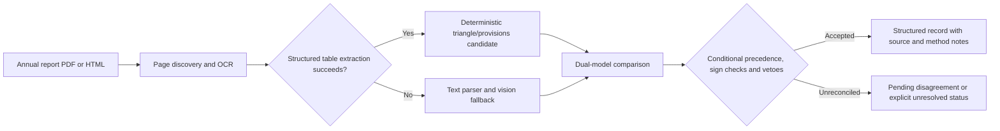

# Lloyd's Reserve Data Collection & Extraction Toolkit

A comprehensive Python toolkit for collecting, extracting, and standardizing Lloyd's of London reserve commentary and numerical reserve data from multiple sources, to support academic research on insurance reserve movements.

The pipeline is the branched, uncertainty-preserving process below.


```mermaid
flowchart LR
  A[Annual report PDF or HTML] --> B[Page discovery and OCR]
  B --> C{Structured table extraction succeeds?}
  C -->|Yes| D[Deterministic triangle/provisions candidate]
  C -->|No| E[Text parser and vision fallback]
  D --> F[Dual-model comparison]
  E --> F
  F --> G{Conditional precedence, sign checks and vetoes}
  G -->|Accepted| H[Structured record with source and method notes]
  G -->|Unreconciled| I[Pending disagreement or explicit unresolved status]
```

Deterministic readings therefore have conditional—not absolute—authority; fallback readings and
remaining validation uncertainty are retained in the audit trail.

## Overview

This toolkit provides three complementary pipelines:

1. **Syndicate Report Download** - Downloads the syndicate annual reports the workbook lists (`scripts/download_from_xlsx.py`, 2014-2024) and classifies their quality
2. **Market Commentary Scraper & Analyzer** - Discovers, scrapes, and standardizes market-wide reserve commentary from multiple sources
3. **PDF Extraction Pipeline** - Extracts structured reserve data (prior year development, LOB breakdowns, claims triangles) from syndicate PDFs using a RAG-lite approach combining deterministic table extraction with dual-LLM verification

Together, these tools produce research-ready datasets by providing:
- **Syndicate-level data**: Detailed line-of-business breakdowns and causal explanations from individual syndicate reports
- **Market-level data**: Standardized reserve movements and causal narratives from official reports, rating agencies, and trade press
- **Structured numerical data**: Claims development triangles with computed prior year development, extracted deterministically and cross-validated against LLM outputs

## Data Locations (for downstream analysis)

The three datasets an analysis project needs, and where to find them:

| Dataset | Location | Format | In git? |
|---------|----------|--------|---------|
| **Syndicate reports** (raw source documents) | `syndicate_reports/pdfs/syndicate_{N}_{YYYY}.pdf` (or `.html` for 2024 iXBRL) | 1,065 PDF/HTML files, 2014–2024 | No (gitignored; `scripts/download_from_xlsx.py` downloads the 1,032 found for the workbook's rows; the other 33 came from an earlier collection pass, see Quick Start) |
| **Extracted structured data** (PYD, opening reserves, LoB mix, dual-LLM outputs, RAG triangle) | `pdf_extraction/syndicate_{N}_{YYYY}.json` | 1,065 JSON files (one per syndicate-year) | Yes |
| **RITC occurrence flags** (external RITC detection with evidence/section/page) | `pdf_extraction/ritc_scan.json` | Single JSON keyed `"{syndicate}_{year}"` | Yes |
| **Data audit results** (per-syndicate-year status, source attribution, reconciliations) | `syndicate_reports/coverage/coverage_status.xlsx` (sheets: `syndicate_years`, `by_year`, `by_syndicate`, `reconciliation`), `coverage_status.json` (full detail incl. LoB mixes), `coverage_report.md` | xlsx + JSON + markdown | Yes |
| **Download ledger** (per-row download status, source URLs, failure reasons) | `syndicate_reports/download_status.json` | JSON keyed `"{syndicate}_{year}"` | Yes |
| **Extraction audit trail** (LLM disagreements, rejections, run statistics) | `pdf_extraction/audit/` (`disagreement_log.json`, `rejection_log.json`, `run_manifest.json`) | JSON | Yes |

The syndicate-year denominator is `syndicate_reports/Lloyds_Syndicates_2014_2024.xlsx`
(1,125 rows in the broader year-of-account candidate list with report URLs). This is
NOT the active-market denominator. That is 1,045 active syndicate-years: 572 for
2014-2019, the workbook's SFCR column (Lloyd's annual reports and SFCRs), and 473 for
2020-2024, Lloyd's official lists of active syndicates, which are the workbook's
per-year sheets. The workbook's own note directs use of its SFCR column, which totals
972; the active-market denominator follows it for 2014-2019 only. The analysis
repository holds the same counts in `src/market_active.py` and
`data/market_active_syndicates.json`. The current written summary is the generated
[coverage report](syndicate_reports/coverage/coverage_report.md), backed by the
companion JSON and workbook. `docs/data-audit-results.md` is an explicitly historical
July 2026 snapshot. To rebuild the current coverage outputs after new downloads or
extractions, run `python scripts/build_coverage_status.py`.

## Architecture

### Two-LLM Design for Market Commentary

- **Perplexity** → Source Discovery (web search with citations)
- **ChatGPT** → Summarization & Standardization (consistent text generation)

This separation leverages each LLM's strengths:
- Perplexity excels at finding current sources with real-time web search
- ChatGPT excels at consistent formatting and structured extraction

### RAG-lite PDF Extraction Pipeline

The PDF extraction pipeline (`test_gemini.py` + `table_extraction.py`) uses a layered approach to maximize accuracy:

```
┌─────────────────────────────────────────────────────────────────────┐
│                    PDF EXTRACTION PIPELINE                           │
├─────────────────────────────────────────────────────────────────────┤
│                                                                     │
│  Step 1: Page Classification (PyMuPDF / Tesseract OCR)              │
│  ├── Scan all pages for keyword signals                             │
│  ├── Classify pages: claims_triangle, premium_mix, pl_account,      │
│  │   provisions, reserve_commentary                                 │
│  └── Only send relevant pages to API backends (cost saving)         │
│                                                                     │
│  Step 2: Deterministic Table Extraction                             │
│  ├── Backend selection: Azure / Nutrient / Adobe                    │
│  ├── Extract claims development triangle (gross preferred)          │
│  ├── Extract LOB premium/claims breakdown                           │
│  ├── Extract claims provisions movement note                        │
│  └── Text-based triangle fallback for columnar PDF layouts          │
│                                                                     │
│  Step 3: Triangle Post-Processing (Python)                          │
│  ├── Validate triangle structure (UW years, row counts)             │
│  ├── Handle run-off syndicates (max UW year < report year)          │
│  ├── Detect and strip summary rows                                  │
│  ├── Compute PYD from diagonal differences                          │
│  └── Apply unit conversion (thousands → millions)                   │
│                                                                     │
│  Step 4: LLM Extraction (Gemini + GPT)                              │
│  ├── Independent extraction of all reserve fields                   │
│  ├── Field-by-field comparison with tolerance rules                 │
│  ├── Absolute-amount triangle PYD, unless sign rule 10.3 or a veto  │
│  ├── Loss-ratio: fills blanks; overrides only on direction clash    │
│  └── Interactive adjudication for unresolved discrepancies          │
│                                                                     │
│  Step 5: Report Classification                                      │
│  ├── first_year_syndicate: no usable cohort up to t-2               │
│  ├── no_triangle_data: no deterministic reading; models not run     │
│  └── Normal: full extraction with cross-validated PYD               │
│                                                                     │
│  Output: pdf_extraction/syndicate_NNNN_YYYY.json                    │
│                                                                     │
└─────────────────────────────────────────────────────────────────────┘
```

**Key design decisions:**

- **Deterministic-first**: claims development triangles are read, where the pipeline can, from the table backend's grids (Azure Document Intelligence by default) or from the page text, and the development figure is computed from the triangle in Python, not by a model's arithmetic. The triangle is not always read without a model: when the table step and the text parser find none, a model reads the triangle page as an image (the page-vision step), and the code also recomputes the figure from the two models' own triangles (section 10.3).
- **LLM as fallback**: When table extraction fails, LLM vision can read triangles from page images, or LLM text extraction reads PYD from reserve narrative text.
- **Dual-LLM verification**: Two independent LLMs (Gemini and GPT) extract the same fields. Disagreements trigger adjudication, either automated (Claude verification) or human review.
- **RAG triangle authority (qualified)**: When a valid *absolute-amount* triangle is extracted deterministically, its computed PYD ordinarily overrides any LLM-extracted value -- unless the gross provisions movement disagrees with it in sign and is an affirmed movement row bound to the report year (the conditions of section 10.3, R138), in which case provisions is authoritative, with the override recorded in the audit trail. A *loss-ratio* triangle is a conditional fallback instead: ordinarily managed- or group-level, it fills a blank narrative value and overrides a syndicate-specific one only where their directions contradict. The full numbered hierarchy is canonical in `docs/ocr-pipeline.md` section 10.3.
- **Every table is bound to the requested syndicate's annual accounts**: combined managing-agent filings (e.g. Tokio Marine Kiln's 510/557/308, Hiscox's 33/6104) carry several syndicates' accounts in one document, and most filings append closed-year underwriting-year accounts. Each page is assigned an entity and a section kind (`docs/ocr-pipeline.md` section 10.8); a table on a companion syndicate's page is never used; an underwriting-year (closed-year) section supplies no opening reserve, provisions movement or business mix, while a same-syndicate claims-development triangle in that section is admitted (which admitted triangle is used is the backend's rule: the Azure path keeps the first unless a later one is gross over net or carries more underwriting years, and the Adobe path additionally scores the annual-accounts section above a closed-year one); and every admitted table records its page and entity.
- **Deterministic figures are gated against the two models**: a table-derived opening reserve is scaled from its header, its page, or the document's unit declaration, and is applied by a two-of-three rule -- it must agree with a model value at some scale, or the two models must disagree with each other; a figure that contradicts two agreeing models is recorded and not applied (section 10.6.1). A deterministic development figure is likewise not applied against two agreeing model signs, nor when it implies a movement above half the reserves while both models read under ten percent (section 10.3); the gate covers every deterministic route, including the code recomputation from the models' own extracted triangles. The one exception is a figure two readings of the filing confirmed by hand (`pdf_extraction/audit/triangle_figures_confirmed_by_hand.json`), which is applied over that gate for its record only; the precedence table in `docs/ocr-pipeline.md` section 10.3 is the statement of which figure wins. A deterministic business mix replaces the models' mix only when its classes sum, within 2%, to a premium total one of the models read, and each model keeps its own total (section 7.7.2); transposed segmental tables are read from their premiums row. The unit source, page and entity are recorded with every figure.
- **Re-extraction is reproducible offline, with measured coverage**: `--offline` re-runs a record from the committed caches, needs no service credentials to do so (round 53: the credential check moved into the cache-miss branch, `tests/test_offline_replay.py`), and aborts on any cache miss instead of calling an API (section 10.8.2) — including the adjudicator, which round 56 found was the one path that still could. Offline implies `--batch`, so a replay never stops for a human. Coverage is not complete and is not asserted to be: the reports whose page-level caches cannot serve a replay are counted and listed in `pdf_extraction/audit/offline_unservable.json`, their committed records stand, and re-deriving them would need fresh paid inference.

## Installation

### Python Dependencies

```bash
# Create virtual environment (recommended)
python -m venv venv
source venv/bin/activate  # On Windows: venv\Scripts\activate

# Install dependencies
pip install -r requirements.txt
```

### OCR Dependencies (for Scanned PDFs)

The syndicate classifier and page scanner include OCR support for scanned PDFs. To enable OCR:

1. **Install Tesseract OCR:**
   - **Windows**: Download from [GitHub releases](https://github.com/UB-Mannheim/tesseract/wiki) or use conda: `conda install -c conda-forge tesseract`
   - **Linux**: `sudo apt-get install tesseract-ocr` (or equivalent)
   - **macOS**: `brew install tesseract`

2. **Install Poppler** (required by pdf2image):
   - **Windows**: Download from [GitHub releases](https://github.com/oschwartz10612/poppler-windows/releases)
   - **Linux**: `sudo apt-get install poppler-utils`
   - **macOS**: `brew install poppler`

The classifier will automatically detect Tesseract in common installation locations (conda environments, Windows default paths, etc.). If OCR libraries are not available, the classifier will fall back to standard text extraction methods (PyMuPDF, pdfplumber) and log a warning.

### Configuration

#### Environment Variables

Create a `.env` file in the project root with your API keys:

```bash
# Required for market commentary source discovery
PERPLEXITY_API_KEY=your-perplexity-api-key

# Required for LLM extraction and summarization
OPENAI_API_KEY=your-openai-api-key
GEMINI_API_KEY=your-gemini-api-key

# Required for table extraction (choose one or more backends)
DOCUMENTINTELLIGENCE_ENDPOINT=your-azure-endpoint
DOCUMENTINTELLIGENCE_API_KEY=your-azure-key
NUTRIENT_API_KEY=your-nutrient-api-key
ADOBE_PDF_SERVICES_CLIENT_ID=your-adobe-client-id
ADOBE_PDF_SERVICES_CLIENT_SECRET=your-adobe-client-secret

# Optional: For enhanced Google search discovery
GOOGLE_API_KEY=your-google-api-key
GOOGLE_CSE_ID=your-custom-search-engine-id
```

**Note:** The `.env` file is already included in `.gitignore` to keep your API keys secure.

## Quick Start

### Syndicate Reports Pipeline

#### 1. Download syndicate reports

`scripts/download_from_xlsx.py` downloads the report for each of the 1,125 rows of
`syndicate_reports/Lloyds_Syndicates_2014_2024.xlsx` and records each row in the download ledger,
`syndicate_reports/download_status.json`. It is resumable: a row already downloaded is skipped.

```bash
# A bounded batch
python scripts/download_from_xlsx.py --limit 100

# Every pending row
python scripts/download_from_xlsx.py

# Try the rows recorded as unavailable again
python scripts/download_from_xlsx.py --retry-failed
```

This route gives 1,032 of the corpus's 1,065 filings; the ledger records the other 93 rows as
unavailable (no working report URL). The remaining 33 filings are not rows of the workbook, so the
ledger has no row for them. Their records were committed in March 2026, before the downloader
existed. They were collected by the earlier pass with `scripts/lloyds_scraper.py`, which scrapes
lloyds.com for its own syndicate list (`data/syndicate_numbers.py`), not for the workbook's rows: the
review of 2 October 2026 found them in that script's local metadata
(`syndicate_reports/metadata/reports.json`, which is not committed). Neither the workbook nor the
ledger holds a source URL for them, so the documented route does not download them again. (A Lloyd's
URL for three of them, 1206/2019, 1400/2015 and 2243/2014, appears in
`market_commentary/discovered_sources.json`.) A list apart from the ledger,
`syndicate_reports/download_addendum.json`, holds the size and SHA-256 of each file and, where the scraper
found one when it was run again on 2 October 2026, the filing's source address;
`scripts/build_download_addendum.py` builds it. `docs/data-audit-results.md` lists the 33.

#### 2. Classify quality of downloaded reports

```bash
python scripts/quality_classifier.py --pdf-dir ./syndicate_reports/pdfs --output ./syndicate_reports/quality_report.json
```

#### 3. Extract structured data from reports

```bash
# Run the extraction pipeline (default: Azure Document Intelligence backend)
python test_gemini.py

# Choose a specific table extraction backend
python test_gemini.py --table-backend azure     # Azure Document Intelligence (default)
python test_gemini.py --table-backend nutrient   # Nutrient.io
python test_gemini.py --table-backend adobe      # Adobe PDF Extract

# Process specific syndicates/years
python test_gemini.py --syndicates 1110 --years 2022

# Non-interactive batch mode (no human adjudication)
python test_gemini.py --batch

# Clean and re-run from scratch
python test_gemini.py --clean
```

### Market Commentary Pipeline

#### Step 1: Discover Sources (Perplexity)

```bash
python scripts/perplexity_discovery.py --years 2022 2023 2024
```

#### Step 2: Scrape Discovered Sources

```bash
python scripts/market_commentary_scraper.py --years 2022 2023 2024
```

#### Step 3: Summarize with ChatGPT

```bash
python scripts/chatgpt_summarizer.py --input market_commentary/market_commentary.json --year 2023
```

## PDF Extraction Pipeline — Detailed

### Overview

The extraction pipeline (`test_gemini.py`) processes each syndicate PDF through multiple extraction layers, cross-validates results, and produces structured JSON output with complete audit trails.

### Table Extraction Backends

Deterministic table extraction (`table_extraction.py`) supports three interchangeable backends, but **Azure AI Document Intelligence is the default and the backend that actually processes the corpus**. It is hard-coded as the default (`TABLE_BACKEND = TableBackend.AZURE`, paid S0 tier) and produced essentially all of the extraction outputs. Nutrient and Adobe are optional alternatives selectable with `--table-backend`, used only for spot comparisons.

| Backend | Method | Speed | Accuracy | Cost | Role |
|---------|--------|-------|----------|------|------|
| **Azure** | Azure AI Document Intelligence prebuilt-layout | Fast (2-5s/batch) | High | ~$0.01/page | **Default — processes the corpus** |
| **Nutrient** | Nutrient.io API with targeted pages | Medium (5-10s) | High | ~$0.05/doc | Optional alternative |
| **Adobe** | Adobe PDF Extract API with full document | Slow (30-60s) | High | ~$0.05/doc | Optional alternative |

All backends extract the same three data types:

1. **Claims Development Triangle** — the NxN matrix of cumulative claims by underwriting year and development period
2. **LOB Breakdown** — gross written premiums and claims incurred by line of business (from segmental analysis)
3. **Claims Provisions Movement** — prior year claims development from the provisions note

### Page Classification

Before sending pages to expensive APIs, the pipeline scans all pages using PyMuPDF (or Tesseract OCR for scanned PDFs) and classifies them by keyword signals:

| Tag | Keywords | Purpose |
|-----|----------|---------|
| `claims_triangle` | "claims development", "years later", "cumulative claims", "outstanding claims provision" | Find the claims development triangle |
| `premium_mix` | "segmental analysis", "gross premiums written", "by class of business" | Find LOB premium/claims breakdown |
| `pl_account` | "technical account", "profit and loss", "claims incurred" | Find income statement data |
| `provisions` | "claims outstanding", "prior year", "movement in provision" | Find provisions movement note |

Only pages matching relevant tags are sent to the API backend, reducing cost by 80-90%.

### Claims Development Triangle Extraction

A triangle's diagonal is the first deterministic source of prior year development; whether its figure is adopted is decided by the precedence and vetoes of `docs/ocr-pipeline.md` section 10.3 (a provisions movement that disagrees in sign, two agreeing model signs, a movement far larger than both models read). The extraction reads a triangle by this priority chain:

1. **API table detection** — Azure/Nutrient/Adobe detects table structure from the PDF
2. **Text-based parsing** — Fallback when API doesn't detect the table; parses raw page text from PyMuPDF, handling both inline and columnar layouts
3. **LLM vision** — Last resort; sends a page image to Gemini for structured triangle extraction

#### Triangle Validation

Extracted triangles undergo structural validation before PYD computation:

- **UW year range**: the most recent underwriting year must satisfy `report_year - 5 <= max_uw_year <= report_year` (`MAX_UW_YEAR_LAG = 5` in `table_extraction.py`; run-off syndicates stop writing before the report date). The Excel-triangle parser (`_parse_triangle_xlsx`) uses this same common admissibility rule, so three- to five-year run-off gaps are permitted.
- **Row/column ratio**: Number of development rows must be consistent with number of UW year columns, accounting for extra development rows in run-off triangles
- **Column fill pattern**: Oldest column must have the most non-null values (upper-left triangle shape)
- **Gross vs net**: Gross triangles are preferred; net-only triangles are used as fallback
- **Sensitivity table exclusion**: Tables containing "change in assumptions", "impact on", "severity" are excluded

#### Run-Off Syndicate Handling

Run-off syndicates (e.g., syndicate 1110) stopped writing new business but their claims continue developing. Their triangles have:
- Fewer UW year columns than a normal active syndicate
- More development rows than columns (claims continue developing after last UW year)
- Max UW year earlier than the report year (e.g., max UW year 2022 in a 2023 report)

The pipeline handles this by:
- Accepting triangles where `max_uw_year` is within 5 years of `report_year` (`MAX_UW_YEAR_LAG`; not requiring exact match)
- Computing `extra_dev_years = report_year - max_uw_year` to adjust row count validation
- Using `report_year - uw_year >= dev_period` for row sizing in the text-based parser

#### Text-Based Triangle Parser

When the API backend doesn't detect a table (common with certain PDF layouts), the text-based parser (`_parse_triangle_from_text`) extracts the triangle from raw PyMuPDF page text:

1. **Year detection**: Two strategies — years on a single header line, or years on consecutive lines (columnar PyMuPDF output)
2. **Label detection**: Identifies development period rows ("12 months later", "2 years later", etc.) and skips them during number collection
3. **Row grouping**: For each development period d, expects `count(UW years where report_year - year >= d)` values — correctly handles year gaps
4. **Stop detection**: Recognises summary rows ("current year estimate", "less amounts paid", "provision for claims outstanding") to stop collecting triangle data

### Prior Year Development (PYD) Computation

PYD is computed from the triangle in Python, not by LLMs, to avoid arithmetic errors:

```
For each underwriting year column u (mature: u <= report_year - 2):
  current_estimate  = the cell on the report-year diagonal, row report_year - u
                      (row 0 is the end of the underwriting year)
  previous_estimate = the cell one row above it (the previous diagonal)
  pyd_for_year      = current_estimate - previous_estimate

Total PYD = sum of pyd_for_year over columns with uw_year <= report_year - 2
            (the two most recent underwriting years are excluded)
```

A cell beyond a column's staircase is not an estimate, and a column whose last cell is not on its diagonal is placed by the table's printed current-estimate row ("Current estimate of cumulative claims", "Estimated total losses"), which the parser keeps for this, or the triangle is refused; so is a grid with a negative cell in a mature column, a step whose smaller estimate is under 2% of the larger, or a printed current estimate that is not the diagonal cell (`_diagonal_cells` in `test_gemini.py`; `docs/ocr-pipeline.md` section 9.1). Until the review of 2 October 2026 the current estimate was the column's last filled cell, wherever it lay: 6112/2016's stray "7" one row past its 2013 column turned +0.893m into -19.264m. `pdf_extraction/audit/stage2_triangle_census.json` lists every committed triangle whose figure that change moves or refuses.

The two most recent underwriting years (`report_year` and `report_year - 1`; `PYD_EXCLUDED_RECENT_UW_YEARS = 2`) are excluded: they are still in their initial development period, and the newest column has no previous estimate to compare against. The manuscript states the same rule (mature years only, $u \le t-2$).

**Unit handling**: If the triangle is in thousands (£000), the total PYD is divided by 1000 to convert to millions (£m). This is detected from page text keywords ("£000", "£'000", "thousands").

**Summary row stripping**: If the LLM or API includes a "current estimate" summary row at the bottom of the triangle (where every column has a value), it is detected and removed before computation. This prevents double-counting.

### First-Year Syndicate Detection

A report is recorded as a first-year stub when it carries no underwriting cohort old enough for prior
year development to be separated from current year activity. The rule turns on **usable mature
cohorts**, not on the raw number of columns in the triangle, and the decision may be taken either
before or after the models run:

- A cohort is usable for PYD when `uw_year <= report_year - 2`, so that a previous diagonal exists to
  compare against. A single 2020 cohort in a 2022 report is mature and does produce development; a
  triangle holding only 2015 and 2016 in a 2016 report does not, however many columns it has.
- **Before the models** (the deterministic table step): if no triangle in the record holds a usable
  cohort *and* the reserve-text steps found no figure either, LLM extraction is skipped and the
  pipeline writes `{"first_year_syndicate": true, ...}` with no `models` block, saving the API cost.
  LOB breakdown is still extracted if available.
- **After the models**: where the deterministic step found nothing but the reserve text might, both
  models run first and the stub is written afterwards — if the RAG step returned no development
  figure, no triangle in the record holds a cohort up to `t-2`, and neither model's figure is printed
  in either block's reserve text. The stub then carries its reason and the evidence, the triangles'
  underwriting years and the figures the models gave, in `first_year_evidence`.
- So **a record with no `models` key does not mean the models were never called.**
  `pdf_extraction/syndicate_1884_2016.json` is a stub of the second kind: no `models` block, and a
  `first_year_evidence` block holding both models' figures. A record's structure says what was
  retained, not whether the API was used; since round 62 its `models_run` field says which
  (`false` before the models, `true` after them).
- A report with no triangle at all is not taken to be young on that account. A filing that states the
  syndicate began in the report year or the year before is young whatever the parsers read, but that
  is the filing-page audit's decision, not this function's: 24 records the pipeline writes as unread
  were restated as first-year stubs on that ground on 30 September 2026
  (`scripts/restate_record_status.py --audited-unread`; `docs/ocr-pipeline.md` §11.2), each with the
  filing's own words, page and file hash in `pdf_extraction/audit/structural_eligibility_audit.json`.
- The inception-year lookup that once flagged a report by `report_year < inception_year + 2` was
  removed in round 58. `pdf_extraction/syndicate_inception_years.json` is kept as a record, and no
  step reads it for a decision. Ten committed stubs were written by that rule and still carried its
  wording until round 62; they have no usable table cache (nine have no Azure cache, and 1100/2024's
  is in the superseded list format the table step refuses), so the pipeline cannot replay them, and their
  exclusion rests on the filing-page audit (`pdf_extraction/audit/structural_eligibility_audit.json`),
  which their restated reason names (`scripts/restate_record_status.py --first-year`).

`docs/ocr-pipeline.md` §11.1 and §11.2 state the executed conditions function by function;
`_no_mature_cohort()` and `_first_year_record()` in `test_gemini.py` are the code
(frozen review of 25 September 2026, D02).

### No Deterministic Reading (`no_triangle_data`)

When the deterministic step reads nothing it can use -- no development figure from a triangle,
the provisions note or a narrative parser, no reserve-movement text and no loss-ratio grid -- the
record is written without running the models:

- it carries `"no_triangle_data": true` (the historical key, kept for its readers), `"excluded": true`,
  `"status": "no_deterministic_reading"`, `"models_run": false` and an `exclusion_reason` that says so;
- the LOB breakdown is kept when the table step found one;
- no figure is obtained, so the report is not in the analysis.

The status describes the parsers, not the filing. Until round 62 the reason read "No claims
development triangle or reserve movement text found in report", and it was not true of every
record written that way: 2468/2022 and 2255/2015 print one-column triangles the structure check
refused (`docs/ocr-pipeline.md` §9.6), 1884/2022 and 3330/2018 were written by a staircase rule
superseded the same day (§11.4), and ten 2024 HTML filings print claims development tables that
their conversion to PDF had lost (§13.1). The thirteen records the current code reads, or takes to
the page-vision step, were extracted again with the models on 29 September 2026 (§11.4); the others
carry the restated status and reason (`scripts/restate_record_status.py`). Of the 45 that were left,
24 state in their filings that the syndicate began in the report year or the year before, and the
filing-page audit restated them as first-year stubs on 30 September 2026 (§11.2); 21 remained unread, and
1400/2014 made 22 on 3 October 2026 (§9.1). Two of the 21 still print a table the parsers do not read, and a
third, 3210/2018, whose table no backend has read (§11.4 names them and says why each stays unread).

### Dual-LLM Extraction and Cross-Validation

After deterministic table extraction, the pipeline runs two independent LLMs on the full PDF:

1. **Gemini** (gemini-2.5-flash) — extracts all structured fields
2. **GPT** (gpt-5-mini) — independently extracts the same fields

The two readings are then compared field by field. A numeric field is a **discrepancy** when the values
differ by more than **0.5% of the larger** *and* by more than **0.05** in absolute terms
(`_is_numeric_near`, from `COMPARISON_REL_TOL` and `COMPARISON_ABS_TOL` in `test_gemini.py`); a missing
value and zero are the same value. Exempt from it are text differences, any field whose name carries
`page` or `confidence`, and the list fields `named_events`, `prior_year_events`, `raw_causal_phrases`,
`specific_events`, `specific_years_affected`, `lob_movements` and `primary_causes`. A `gross_premium_mix`
percentage that fails is compared again on absolute values within **5%** (`MIX_PERCENTAGE_REL_TOL`),
because a negative written premium leaves its sign convention ambiguous.

A discrepancy is a comparison-stage flag, not a rejected record: `resolve_computed_fields` settles the
derived fields next, and what remains is written to the disagreement log and counted in the record's
`hard_failures`.

When a deterministic RAG triangle PYD is available from an **absolute-amount** triangle, it ordinarily takes precedence over both LLMs:
- First, where the triangle came from a table backend (Azure, Nutrient or Adobe) and a gross provisions movement is also available, the two are sign-compared. The provisions figure overrides the triangle only when all three hold: the table is an affirmed movement note, its column carries the report year in its own header (R138), and the figure is not zero; and then only on a sign disagreement. A provisions figure that is not an affirmed, report-year-bound movement row leaves the triangle standing (canonical hierarchy: `docs/ocr-pipeline.md` section 10.3)
- If an LLM agrees with the prevailing deterministic value (within ±0.5m), the LLM value is confirmed
- If an LLM disagrees, the absolute-amount triangle value overrides it and the override is recorded in `data_quality_notes`
- The override is vetoed (`_pyd_override_gate`, `test_gemini.py`) where the two LLM values agree with each other on the opposite sign to the deterministic figure, or where the deterministic movement exceeds 50% of opening reserves while both LLM movements are below 10%; the models then stand and the note records the rejected figure. The same veto applies on every deterministic route (triangle, provisions fallback and the code recomputation from the models' own triangles), and is lifted only where the figure equals, to within half a thousand, a figure that two readings of the filing confirmed and that is registered in `pdf_extraction/audit/triangle_figures_confirmed_by_hand.json` (3 records); the figure is then applied over the veto with a note saying so (`_rag_veto`; precedence table in `docs/ocr-pipeline.md` section 10.3)

A **loss-ratio** triangle does not take precedence in the same way. Being ordinarily managed- or group-level, it fills a blank narrative value, and overrides a syndicate-specific narrative value only where the two directions contradict; an agreeing narrative value is retained.

### LLM Output Caching

All LLM API calls are cached in `pdf_extraction/llm_cache/` using SHA-256 hashes of `(model, prompt_version, prompt_text, syndicate, year[, page])`. This means:
- Re-running the pipeline does not re-call LLMs for already-processed reports
- Changing the prompt wording or bumping `PROMPT_VERSION` auto-invalidates affected caches
- Table extraction caches use a separate `_CACHE_VERSION` counter — bump it when extraction logic changes

### Output Format

Each processed report produces a JSON file in `pdf_extraction/`. The examples are committed records, abridged: 1110/2022's, 1322/2023's and 4020/2015's. A model block carries more fields than the first shows, and every value shown is the record's (`tests/test_readme_output_example.py`):

```json
{
  "extraction_timestamp": "2026-09-21T08:11:34.033787+00:00",
  "spec": {
    "prompt_version": "2.13",
    "driver_prompt_version": "2.13",
    "responses_served_from_cache": null,
    "field_definitions_version": "1.0",
    "tolerance_rules_version": "1.0"
  },
  "source_file": "syndicate_reports\\pdfs\\syndicate_1110_2022.pdf",
  "models": {
    "gemini-2.5-flash": {
      "opening_reserves_gbp_m": 221.885,
      "prior_year_development_gbp_m": 9.082,
      "prior_year_development_pct": 4.09,
      "direction": "strengthening",
      "gross_premiums_written_gbp_m": 333.442,
      "gross_premium_mix": [
        {"line_of_business": "Fire and other damage to property", "amount_gbp_m": 5.853, "percentage_of_total": 1.8},
        {"line_of_business": "Marine, aviation and transport", "amount_gbp_m": 0.635, "percentage_of_total": 0.2},
        {"line_of_business": "Pecuniary loss", "amount_gbp_m": 3.037, "percentage_of_total": 0.9},
        {"line_of_business": "Third party liability", "amount_gbp_m": 72.786, "percentage_of_total": 21.8},
        {"line_of_business": "Other", "amount_gbp_m": 2.95, "percentage_of_total": 0.9},
        {"line_of_business": "Reinsurance", "amount_gbp_m": 248.181, "percentage_of_total": 74.4}
      ],
      "_rag_triangle": {
        "type": "gross",
        "currency": "GBP",
        "units": "thousands",
        "underwriting_years": [2013, 2014, 2015, 2016, 2017, 2018, 2019, 2020, 2022],
        "development_rows": ["...one row per development year..."]
      }
    },
    "gpt-5-mini": {"...": "...the same fields, from the second model..."}
  },
  "validation": {
    "passed": true,
    "total_discrepancies": 18,
    "within_tolerance": 18,
    "hard_failures": 0,
    "hard_failure_details": []
  }
}
```

For first-year syndicates:
```json
{
  "first_year_syndicate": true,
  "reason": "No underwriting year old enough for prior year development in the report's triangles, and no prior-year figure stated in its reserve text",
  "models_run": false,
  "syndicate": 1322,
  "year": 2023
}
```

For reports the deterministic step could not read (the models were not run):
```json
{
  "no_triangle_data": true,
  "excluded": true,
  "status": "no_deterministic_reading",
  "models_run": false,
  "exclusion_reason": "No deterministic reading: the table, page-text and narrative parsers found no prior-year figure, no reserve-movement text and no loss-ratio triangle they could use. This describes the parsers, not the filing, which may still print a claims development table they could not read. The models were not run, so no figure was obtained and the report is not in the analysis.",
  "syndicate": 4020,
  "year": 2015
}
```

## File Structure

See [file_and_folder_structure.md](file_and_folder_structure.md) for the complete directory tree. Key directories:

```
lloyds_reserve_stress_testing/
│
├── .env                                    # API keys (gitignored)
├── requirements.txt                        # Python dependencies
├── README.md
├── CLAUDE.md                               # AI assistant context (gitignored, local only)
├── table_extraction.py                     # Deterministic table extraction (triangle, LOB, provisions)
├── test_gemini.py                          # Main extraction pipeline (RAG-lite + dual-LLM)
├── adjudicate.py                           # LLM disagreement adjudication
├── manual_override.py                      # Manual override for extraction results
│
├── data/
│   ├── syndicate_numbers.py                # The earlier scraper's syndicate list (US Treasury list, January 2025)
│   └── __init__.py
│
├── docs/                                   # Documentation and validation files
│   ├── data-construction.md                # Data construction methodology
│   ├── exposure-adjustment.md              # Exposure adjustment documentation
│   ├── llm-prompt-development.md           # LLM prompt development notes
│   ├── ocr-pipeline.md                     # OCR pipeline documentation
│   ├── prompt-history.md                   # Generated: prompt versions behind the cached responses
│   ├── table-4-explanation.md              # Table 4 explanation
│   └── validation/                         # Validation artefacts (xlsx, csv)
│
├── syndicate_reports/                      # Syndicate report outputs (gitignored)
│   ├── pdfs/                               # Downloaded PDF and HTML files (one per syndicate-year; count in the dataset table above)
│   ├── metadata/                           # reports.json, summary.json, errors.json
│   └── quality_report.json                 # Quality classification results
│
├── pdf_extraction/                         # Extraction pipeline outputs
│   ├── syndicate_NNNN_YYYY.json            # Structured extraction results (one per syndicate-year; count in the dataset table above)
│   ├── audit/                              # Disagreement/rejection logs, run manifest
│   ├── adobe_output/                       # Adobe PDF Extract API raw outputs
│   ├── azure_output/                       # Azure Document Intelligence cached results
│   ├── nutrient_output/                    # Nutrient.io cached page extractions
│   ├── html_converted/                     # HTML reports converted for processing
│   ├── llm_cache/                          # LLM response cache (SHA-256 keyed)
│   ├── llm_slim/                           # Slimmed LLM cache
│   ├── ocr_page_cache/                     # Tesseract OCR results per page
│   └── spec/                               # Extraction spec versions
│
├── market_commentary/                      # Market commentary outputs
│   ├── pdfs/                               # Lloyd's official + AM Best reports
│   ├── full_text/                          # Full extracted text (audit trail)
│   ├── market_commentary.json              # Main scraped data
│   ├── audit_manifest.json                 # File manifest with hashes
│   ├── discovered_sources.json             # Perplexity discovery results
│   └── discovered_sources_urls.json        # Extracted URLs from discovery
│
├── results/
│   ├── market/                             # ChatGPT market commentary outputs (2014-2024)
│   │   ├── standardized_movements_YYYY.json
│   │   ├── lob_summaries_YYYY.json
│   │   └── market_report_YYYY.md
│   ├── syndicate/                          # ChatGPT syndicate outputs
│   │   ├── standardized_syndicate_movements.json
│   │   ├── syndicate_summary.json
│   │   ├── year_summary.json
│   │   └── lob_summary.json
│   └── combined/                           # Merged market + syndicate corpus
│       ├── unified_corpus.json             # Combined market + syndicate data
│       ├── corpus_by_lob.json              # Organized by line of business
│       ├── corpus_by_year.json             # Organized by year
│       └── corpus_summary.json             # Summary statistics
│
├── scripts/
│   ├── lloyds_scraper.py                   # Earlier report scraper (the 33 filings off the workbook)
│   ├── download_from_xlsx.py               # Report downloader for the workbook's rows (the current route)
│   ├── quality_classifier.py               # Reserve commentary quality classifier
│   ├── ocr_scanned_pdfs.py                 # OCR processing for scanned PDFs
│   ├── build_coverage_status.py            # Build coverage/audit outputs
│   ├── syndicate_summarizer.py             # ChatGPT syndicate summarization
│   ├── market_commentary_scraper.py        # Market commentary scraper
│   ├── chatgpt_summarizer.py               # ChatGPT market summarization
│   ├── perplexity_discovery.py             # Source discovery via Perplexity
│   ├── merge_corpus.py                     # Merge market + syndicate data
│   └── analyse_strengthenings.py           # Analysis utilities
│
└── analysis/                               # Analysis outputs (gitignored)
    └── quality.json
```

## Quality Classification Criteria

The syndicate classifier uses a 4-tier system based on line-of-business (LoB) breakdown and causal clarity:

| Quality             | Criteria                                                                  | Example                                                                                                                          |
| ------------------- | ------------------------------------------------------------------------- | -------------------------------------------------------------------------------------------------------------------------------- |
| **VERY_HIGH**       | Clear split by line of business WITH clear causal descriptions            | "Marine: £36.1m release due to favourable large loss experience; Property: £5.3m strengthening from inflation impacts"         |
| **HIGH**            | Split by line of business, but lacking clarity on root causes             | "Marine: £36.1m release; Property: £5.3m release; Aviation: £12.4m surplus" (with division breakdown but generic explanation) |
| **MEDIUM**          | Some reserve commentary with direction/amounts but no clear LoB breakdown | "Overall reserve release of £54.7m due to favourable experience" (no class-specific breakdown)                                  |
| **LOW**             | Minimal commentary, boilerplate text, or extraction failed                | General reserve discussion without class-specific details or quantified movements                                                |

**Key Classification Factors:**

- **Primary factor**: Line of business breakdown (multiple classes with amounts) → determines HIGH/VERY_HIGH vs MEDIUM/LOW
- **Secondary factor**: Causal clarity (specific root cause terms like "catastrophe", "inflation", "IBNR reductions") → differentiates VERY_HIGH from HIGH

## Expected Results

### Syndicate Reports

The corpus is the dataset table's 1,065 filings, 2014-2024 (Quick Start step 1 says where they
came from). The generated [coverage report](syndicate_reports/coverage/coverage_report.md) gives,
for each year's rows of the workbook, how many were downloaded and how many extracted in full.

### Market Commentary

| Metric                  | Source                | Availability |
| ----------------------- | --------------------- | ------------ |
| Prior year movement %   | Lloyd's Annual Report | 2014-2024    |
| Prior year movement £m  | Lloyd's Annual Report | 2014-2024    |
| Combined ratio          | Lloyd's Annual Report | 2014-2024    |
| Attritional loss ratio  | Lloyd's Annual Report | 2014-2024    |
| Major claims ratio      | Lloyd's Annual Report | 2014-2024    |
| LOB-specific movements  | Lloyd's Annual Report | 2017-2024    |
| Causal narratives       | Multiple sources      | Variable     |

## Audit Trail

The pipeline maintains complete audit trails at every stage:

1. **Original PDFs**: Stored in `syndicate_reports/pdfs/`, unchanged
2. **Table extraction caches**: Raw API responses cached in `pdf_extraction/azure_output/`, `nutrient_output/`, `adobe_output/` — keyed by `_CACHE_VERSION` for automatic invalidation when extraction logic changes
3. **LLM response caches**: All LLM calls cached in `pdf_extraction/llm_cache/` — keyed by SHA-256 of prompt content for automatic invalidation when prompts change
4. **Extraction results**: Full structured JSON per report in `pdf_extraction/syndicate_NNNN_YYYY.json`, including both LLM outputs, RAG triangle data, and validation results
5. **Disagreement log**: All LLM disagreements and resolutions recorded in `pdf_extraction/audit/disagreement_log.json`
6. **Rejection log**: Reports rejected during adjudication in `pdf_extraction/audit/rejection_log.json`
7. **Run manifest**: Per-run statistics (processed/passed/failed/skipped counts, cost, tokens) in `pdf_extraction/audit/run_manifest.json`. A run made with `--offline` calls no API, and its entry is marked `offline`: its tokens and cost are the sums its cached responses recorded when they were made, with `new_spend_usd` 0.0 and a `basis` that says so (`tests/test_run_manifest_offline.py`)
8. **Run-off register**: `pdf_extraction/audit/runoff_register.json` records, for each of the eight records that carry a development figure and an adopted gross written premium at or below zero, whether its own filing states that the syndicate is in run-off in that year: the verdict, the date the run-off is stated to begin, and the filing's words with page and file hash (`tests/test_runoff_register.py` holds each quote to its page). A premium sign is not a run-off test: 3623/2018 is a live syndicate whose negative premium is a return premium, and 5183/2024's filing puts its run-off at 1 January 2025. Six of the eight are run-off years. 2255/2015 is one: its Future developments statement says it "continues to run-off its portfolio of liabilities", and the standard going concern paragraph of its basis of preparation, which says the managing agent expects it to "continue to write business", is recorded word for word beside that statement in the entry's note (the author's decision).
9. **Run-off corpus register**: `pdf_extraction/audit/runoff_corpus_register.json` records, for each of the 111 syndicate-years whose filing says that the syndicate itself is in run-off or has stopped, or will stop, underwriting (in the words the statement forms read, and those the readers found), what the filing says and how it is read: WHOLE (in run-off from the start of the year or before; 43), PART (the run-off begins during the year; 9), AFTER (it begins at or after the year end; 40) or NOTCOUNT (the filing's words do not settle it, or the statement is about another entity; 19), with the date the filing gives, its words, the page, the printed page and the file's hash (`tests/test_runoff_corpus_register.py` holds each quote to its page and each category to its date). The whole-year run-off rule reads the WHOLE entries. The premium register (item 8) copies the seven entries the two share, and a test fails if they differ. **What is complete.** The first version of the register (88 entries) was built from filings that say run-off or ceased underwriting and was checked only against its own words; it missed 17 syndicate-years, among them Syndicate 1209's 2016 and 2017 filings, which never say run-off (the independent review of 1 October 2026 found ten of them, its verifier two more, and the statement forms five). Every readable page of every filing of the corpus (1,065) is now scanned with the statement forms in `scripts/runoff_statement_forms.py` (the forms in which a filing says that its syndicate is in run-off, has stopped underwriting or will stop: nine sentence-level patterns, the run-off ones with the syndicate itself as the subject), and `tests/test_runoff_corpus_register.py` fails if a filing that a form matches is neither an entry nor reviewed apart, or if a matching sentence is not in the register's `scan_reviewed` list (66 filings, which hold 84 statements; each sentence with the reason it is not the syndicate's own run-off: another entity, a class or line, an office or channel, or not a stop). For those forms, then, the WHOLE, PART and AFTER entries are complete over every readable page of the corpus, in or out of the analysis's working sample: every filing yields text, and a page is readable when it has a text layer or text in the committed OCR page cache; a page with neither is not read. 3210/2018 was fetched again on 2 October 2026, because its earlier copy was a cut-short download that opened with no page; Lloyd's file is a scan with no text layer, and its page text comes from local OCR (`pdf_extraction/ocr_page_cache/syndicate_3210_2018.json`, made with the project's own Tesseract route, with no paid call). It is a WHOLE entry (Syndicate 3210 has been in run-off since 31 December 2016), and its extraction record, which was made from the earlier copy, carries no development figure and is unchanged, so the filing does not reach the analysis's working sample. `UNREADABLE` in `scripts/runoff_statement_forms.py` is empty, and the corpus test fails if any filing yields no text; another test holds every form to a statement that only it matches. The forms were widened on 3 October 2026 (the review of 2 October 2026, deferred item 1): the third person ("no longer writes"), stopped, discontinued, withdrew from, closed to new business, dormant, winding down, merged into, "ceased all underwriting activities", "last underwriting year was", "final year of account", "has not written any new business since", "does not have a 2020 underwriting year of account", "is a run-off vehicle" and "is being run off"; and a place other than Lloyd's, an office, a coverholder, a class, a line or an account no longer ends a statement that the syndicate has stopped ("ceased underwriting new business in Dubai"), nor is a new wording read in a clause that names one ("the Syndicate's coverholder in Dubai is dormant"), so ten scan_reviewed statements that only that over-match read were taken off the list. They were widened a second time on 3 October 2026 (deferred item 2) to read a filing that discontinues the syndicate or its SPA itself for a year of account or from a date ("The decision has been made to discontinue the SPA for the 2022 year of account onwards", 6131/2021); a clause that names a class, a line, a coverholder, an office, an account other than a year of account or a place is still not read, and nor is one that only says the managing agent may, or intends to, discontinue. The scan of the corpus with the widened forms was run on 3 October 2026, on the PC with the filings, over every page the readers return text for: 166 filings hold a sentence a form matches, and one sentence in one filing (6126/2017) was in no entry and had not been reviewed; it was listed in the `scan_reviewed` list that day, and the review of the stage-2 commits moved it to the entries as AFTER (below), and no entry lost its match. The second widening was scanned the same way: it adds one sentence in one filing (6131/2021; 167 filings in all), which is now an AFTER entry, and no entry lost its match. Four entries were added for deferred item 2: 6131/2021 is AFTER (its filing says that the SPA is discontinued for the 2022 year of account onwards, after a year in which it wrote), and 6112/2016, 6119/2016 and 6121/2016 are NOTCOUNT (each says that Syndicate 2003, the SPA's host, will not continue its whole account quota share purchase with the SPA for 2017, which is the host's purchase decision, and the filing does not turn it into a statement about the SPA; Lloyd's candidate list of syndicate-years has no 2017 row for any of the three, while its rows for 6111, which the same managing agent ran, go to 2018, but that is not the filing's own words). On 3 October 2026, in the review of the stage-2 commits, 6126/2017 was moved from the `scan_reviewed` list to the entries as AFTER: its filing says that the SPA has no 2018 year of account, that its property book is written through a dedicated syndicate which the SPA is converting to, and that the SPA received approval to transition to a full independent syndicate status; it wrote for 2017 (gross written premium of 42,496 in £000), and its 2017 year of account is its last, as the year each of 1209/2015, 2088/2019, 2007/2018 and 6133/2021 covers is its last although its business went on in another syndicate. The filing gives no date. Syndicate 3268's 2019 filing says that the SPA's 2016 year of account was accepted as a reinsurance to close into Syndicate 3268 on 1 January 2019. Of the 56,689 pages of the 1,065 filings, 1,778 hold no text at all (no text layer and no text in the committed OCR page cache) and 333 more hold 50 characters or fewer (such as a cover title, a running head, a page number, a blank-page notice or a printer's line), too little to carry a statement: the scan reads them like any other page, and none of them has a sentence a form matches; every filing has pages that hold text. That is the whole of the claim. Keyword and pattern scans can miss oblique wording, as both 1209 years show, and the forms are the defence: one entry's own words match no form (4321/2023, "the syndicate will no longer write new follow capacity insurance business at Lloyd's"), and a statement in words that no form matches and no reader found is not in the register. Seven readings differ from the first reading of the corpus (30 September 2026), each by the filing's words: 2088/2019 and 1975/2021 are AFTER (2088 wrote business through 2019; 1975 says it will cease underwriting after 2022), 2468/2020 is PART (its run-off began on 6 January 2020), and 1884/2023, 1884/2024, 1254/2022 and 1254/2023 are NOTCOUNT (the filings never say the syndicate is in run-off, and describe it as underwriting reinsurance to close and legacy business). 1110/2023 was reviewed and its filing states no run-off; it is recorded apart from the entries.

**What a recorded cost counts.** A cost is the provider's token counts priced by `PRICING` in
`test_gemini.py`, a table typed in with the pipeline in 02e160d4 (12 March 2026) with no source
recorded. A Gemini response is priced as its prompt at the input rate and its response and thinking
tokens at the output rate (`_gemini_cost_usd`; Gemini 2.5 bills thinking tokens as output), and the
run's spend cap `LLOYDS_MAX_RUN_COST_USD` reads the same recorded totals (`_spend_cap_reached`).
**Costs recorded before 30 September 2026, when `_gemini_cost_usd` came in, leave out Gemini's
thinking tokens**: every model block's `_extraction_meta.cost_usd`, every record's `total_cost_usd`
and the run manifest's totals, and a record written later from a response cached before then keeps
that response's cost. No recorded cost includes the page-vision calls, whose cost is computed but not
recorded, and that formula still leaves the thinking tokens out. For the re-extraction of
29 September 2026, the `extracted.cost` block of `pdf_extraction/audit/redecision_pending.json`
counts both: the thinking tokens its twelve Gemini responses recorded, and its page-vision calls. An offline run calls no API: its
run-manifest entry is marked `offline` and says that its totals are what the cached responses it read recorded when they were made, not
new spend (the five offline runs of 3 October 2026 read as US$4.35 until they were marked).

For market commentary, full extracted text is stored in `market_commentary/full_text/` with SHA-256 content hashes in `audit_manifest.json`.

## Source Categories (Market Commentary)

### Lloyd's Official (Highest Quality)

- Annual Reports: Detailed LOB commentary in "Market Results" section
- Analyst Presentations: Summarized metrics with management commentary
- Half Year Reports: Interim reserve development updates
- Aggregate Accounts: Technical financial data

### Rating Agencies

- **AM Best**: Lloyd's-specific annual reports with reserve analysis
- **Fitch/S&P/Moody's**: Market commentary in rating rationales

### Trade Press

- **Reinsurance News**: Breaking news on results
- **Artemis**: Focus on catastrophe and ILS angles
- **Insurance Journal**: US-focused Lloyd's coverage
- **Insurance Times UK**: Detailed UK market analysis
- **Insurance Business Mag**: International perspectives

### Broker/Analyst Reports

- **Gallagher Re**: Annual Lloyd's market reports
- **Alpha Insurance Analysts**: Detailed syndicate and market analysis
- **PNO Insurance**: Australian broker perspective

## Causal Factor Categories

The system identifies these causal categories:

1. **Social Inflation**: US litigation trends, nuclear verdicts, attorney advertising
2. **Economic Inflation**: Claims cost inflation, wage inflation, material costs
3. **Catastrophe Events**: Named hurricanes, floods, wildfires, earthquakes
4. **Regulatory/Legal**: Court rulings (e.g., FCA BI test case), Ogden rate changes
5. **Geopolitical**: Ukraine conflict, sanctions, political violence
6. **Pandemic**: COVID-19 BI claims, contingency, event cancellation
7. **Market Factors**: Reinsurance availability, pricing adequacy, reserve margins

## Troubleshooting

### Common Issues

**"Failed to download" errors**

- Lloyd's servers may be slow; increase `--delay` to 3-5 seconds
- Some syndicates may have ceased operations; check errors.json

**"Failed to extract text" errors**

- Some older PDFs may be scanned images requiring OCR
- Ensure Tesseract OCR and Poppler are installed (see Installation section)
- The pipeline automatically attempts OCR when standard text extraction fails

**"No triangle found" or "no_triangle_data"**

- Some syndicate reports (especially run-off years) genuinely lack a claims triangle
- Check the Azure/Nutrient cached output to see what tables were detected
- The text-based fallback parser handles columnar PDF layouts that API backends miss

**Triangle PYD disagrees with LLM**

- An absolute-amount RAG triangle PYD ordinarily prevails over both LLMs (the hierarchy under "Dual-LLM Extraction and Cross-Validation" above, canonical in `docs/ocr-pipeline.md` section 10.3). On a sign disagreement the provisions movement overrides a table-backend triangle only when all three conditions of section 10.3 hold: the table is an affirmed movement note, its column carries the report year in its own header (R138), and the figure is not zero; otherwise the triangle stands. No absolute-amount triangle, provisions or code-recomputed figure replaces two LLM values that agree on the opposite sign, or two movements below 10% of reserves when the deterministic movement exceeds 50% (the model-agreement veto) -- except a figure two readings of the filing confirmed in `pdf_extraction/audit/triangle_figures_confirmed_by_hand.json`, which is applied over that veto for that record and that figure only. A loss-ratio triangle instead fills a blank narrative value or overrides a contradicting direction only. Every such replacement is logged
- Check `data_quality_notes` in the output JSON for override details
- Common causes: LLM reading net instead of gross triangle, or including summary rows

**Stale extraction cache**

- Bump `_CACHE_VERSION` in `table_extraction.py` to invalidate all cached table extractions
- Delete `pdf_extraction/llm_cache/` to force re-extraction from all LLMs
- Old caches with wrong version numbers are automatically re-extracted

**Network Issues**

- Both download scripts wait between requests (`--delay`). If you encounter 429 errors, increase the delay.

**API Limits**

- Perplexity has rate limits (~100 requests/day on free tier)
- Azure Document Intelligence: 15 requests/second
- Adobe PDF Extract: rate-limited per plan

## Pre-2014 Data

Reports for years 1983-2013 are held by Lloyd's and available on request.

Contact: lloyds-mrd-returnqueries@lloyds.com

When requesting, mention:
- Academic research purpose
- Specific syndicates of interest (if known)
- Years required
- Expected data format (PDF preferred)

## Research Applications

The datasets produced by this toolkit support academic research on insurance reserve movements, including:
- Empirical analysis of prior-year reserve development across syndicates and lines of business
- Causal narrative extraction from syndicate and market commentary
- Line-of-business conditioning based on market commentary

### Suggested Workflow

1. **Download syndicate reports** (the workbook's rows; the 33 earlier filings are not re-downloaded,
   see Quick Start), then classify their reserve commentary:
   ```bash
   python scripts/download_from_xlsx.py
   python scripts/quality_classifier.py --pdf-dir ./syndicate_reports/pdfs
   ```

2. **Extract structured data**:
   ```bash
   python test_gemini.py --table-backend azure
   ```

3. **Scrape market commentary**:
   ```bash
   python scripts/market_commentary_scraper.py --years 2014 2015 2016 2017 2018 2019 2020 2021 2022 2023 2024
   ```

4. **Generate summaries and merge**:
   ```bash
   python scripts/chatgpt_summarizer.py --input market_commentary/market_commentary.json --year 2023
   python scripts/merge_corpus.py --syndicate results/syndicate/ --market results/market/
   ```

## Limitations

- **Paywall content**: Some trade press requires subscriptions
- **PDF quality**: OCR errors possible in older reports; some syndicates have scanned-only PDFs
- **Causal depth**: Most sources provide thematic rather than specific causation
- **Run-off syndicates**: Triangle may be missing from some report years
- **API limits**: Perplexity (~100/day free), Azure DI (15/second), Adobe (plan-dependent)
- **Triangle format variation**: Some syndicates present triangles in non-standard formats that require text-based fallback parsing

## Contributing

To add new sources:

1. Add URL patterns to `SourceRegistry` in `market_commentary_scraper.py`
2. Add extraction patterns for new source formats
3. Update `CURATED_SOURCES` in `perplexity_discovery.py`

To add a new table extraction backend:

1. Add the backend to `TableBackend` enum in `table_extraction.py`
2. Implement `_extract_<backend>()` following the existing pattern
3. Return an `ExtractionResult` with `triangle`, `lob`, and `provisions` fields

## License

For academic research use only. Lloyd's syndicate reports are copyright of respective managing agents.

## Documentation

| Document | Description |
|----------|-------------|
| [README.md](README.md) | This file — project overview |
| [file_and_folder_structure.md](file_and_folder_structure.md) | Complete directory tree |
| [docs/data-construction.md](docs/data-construction.md) | Data construction methodology |
| [docs/exposure-adjustment.md](docs/exposure-adjustment.md) | Exposure adjustment documentation |
| [docs/llm-prompt-development.md](docs/llm-prompt-development.md) | LLM prompt development notes |
| [docs/ocr-pipeline.md](docs/ocr-pipeline.md) | OCR pipeline documentation |
| [docs/prompt-history.md](docs/prompt-history.md) | Generated: which prompt version governed each committed model response, and the records the round-55 prompt corrections touched (`scripts/prompt_history.py`) |
| [docs/table-4-explanation.md](docs/table-4-explanation.md) | Table 4 explanation |

## References

- Lloyd's Annual Reports: https://www.lloyds.com/about-lloyds/investor-relations/financial-results
- AM Best Lloyd's Methodology: https://www.ambest.com/ratings/methodology
- CAS E-Forum: https://www.casact.org/publications/e-forum

## Running the tests

```
pytest -q
```

collects the offline suites (the novelty/unit tests under
`scripts/stress_test/novelty/tests/` and the scripts under `tests/`) as pinned by
`pytest.ini`, and runs them from the repository root wherever it is started
(`conftest.py`). A test may skip only for a reason declared in `conftest.py`'s
`SKIP_BUDGET` -- an optional SDK that is not installed, a source filing that is not
committed, the paid test's opt-in -- and any other skip fails the run.

The one test that can call the paid model APIs, `tests/test_single_report.py::test_single_report_extraction`,
is marked `paid_api` and runs only with `LLOYDS_ALLOW_PAID_API=1`; without that opt-in it
skips, whatever keys the environment or `.env` holds, so the default command contacts no
paid service. `pytest -m "not paid_api"` deselects it outright. The replays in the suite
run offline from the committed caches. The Azure and Nutrient scripts in `tests/` hold no
test functions; they are runnable directly (`python tests/test_azure.py <pdf>`) and call
the paid services when run that way.

`python scripts/record_tests.py` runs the suite offline and writes `tests-run-report.json`
(commit, dirty flag, collected, passed, failed, skipped with reasons); the manuscript's
count is generated from that record, and `tests/test_tests_run_report.py` fails when it is
dirty, not green or no longer the size of the suite.
